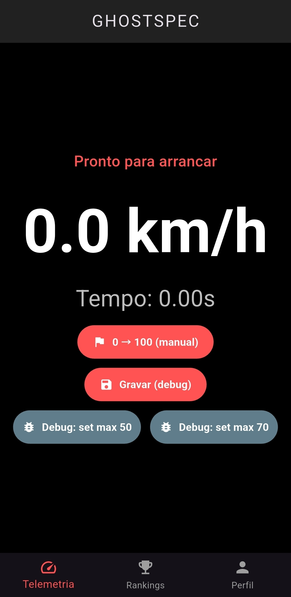
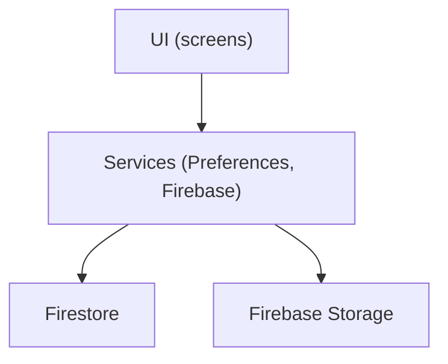

# 🏎️ GhostSpec — Benchmarking App (MVP)

Uma aplicação móvel multiplataforma concebida em Flutter para medir e partilhar métricas de performance de veículos em tempo real — incluindo top speed, 0→100 e tempos de condução — com rankings online via Firebase.

Este README descreve o estado atual do projeto, como configurar e executar a aplicação, e quais os próximos passos recomendados.

---
# 🎯 Propósito e Público-Alvo

O GhostSpec nasceu para entusiastas do mundo automóvel e condutores que desejam monitorizar o comportamento dos seus veículos. A aplicação resolve o problema de equipamentos de telemetria caros, transformando o smartphone numa ferramenta de medição relativamente precisa e acessível, combinando dados de satélite com uma componente social competitiva e saudável.

---
## 📱 Capturas / Demo
<p align="center">
	
	
	
	
</p>
---

## ⛓️ Requisitos e dependências principais

- Flutter SDK (recomendado: versão `stable` compatível com Dart SDK ^3.11.5)
- Dart SDK >= 3.11

Dependências declaradas em [ghost_specs/pubspec.yaml](ghost_specs/pubspec.yaml):

- `geolocator` — geolocalização e stream de posição
- `firebase_core`, `firebase_auth`, `cloud_firestore`, `firebase_storage`, (backend e persistência online)
- `image_picker` — upload de foto de perfil
- `shared_preferences` — persistência local de preferências

---

## 🪛 Instalação e configuração rápida

1. Clone o repositório e entre na pasta da app:

```bash
git clone <repo-url>
cd ghost_specs
```

2. Instale dependências:

```bash
flutter pub get
```

3. Configure o Firebase (uma das opções):

- Preferível: use `flutterfire configure` (requer `flutterfire_cli`) para gerar `lib/firebase_options.dart` e adicionar as configurações nativas;
- Alternativa: colocar `google-services.json` (Android) e `GoogleService-Info.plist` (iOS) nos respetivos diretórios. 
Em seguida colocar o código em `lib/main.dart` tentar inicializar com as configs nativas e tem um fallback hardcoded caso falhe (não recomendado para produção).

4. Executar a app num dispositivo/emulador:

```bash
flutter run
```

5. Executar análise e testes:

```bash
flutter analyze
flutter test
```

---

## 📎 Como usar (fluxo rápido)

1. Abra a app.
2. Registe uma conta ou inicie sessão.
3. No Dashboard, ative o GPS e utilize o botão `0 → 100 (manual)` para medir aceleração, a medição de velocidade maxima é efetuada de forma automatica.
4. Consulte `Rankings` para ver tempos e velocidades de outros utilizadores.

Notas:
- O campo "O teu Carro" no registo é pré‑preenchido com a preferência local (guardada por `SharedPreferences`).

---

## ⚙️ Funcionalidades implementadas (resumo)

- Autenticação com Firebase (`firebase_auth`) — registo e login.
- Monitorizar GPS em tempo real com `geolocator` — display de velocidade e medição 0→100.
- Rankings online via Firestore (`rankings` e `max_speeds`).
- Perfil do utilizador com upload de foto (`image_picker` + `firebase_storage`) limitado às quotas do plano gratuito.
- Persistência local de preferências com `shared_preferences` (serviço: `lib/services/preferences_service.dart`).
- UI com 3 ecrãs: Dashboard, Rankings, Perfil (`lib/screens/`).
- CI: workflow GitHub Actions em [.github/workflows/flutter_ci.yml](.github/workflows/flutter_ci.yml).


---

## 🗂️ Estrutura de ficheiros (destacados)

- `lib/main.dart` — inicialização da app, Firebase e leitura de preferências ([ver ficheiro](lib/main.dart)).
- `lib/services/preferences_service.dart`: wrapper simples para `SharedPreferences`.
- `lib/screens/login_screen.dart`: ecrã de login/registo; guarda `preferred_car_name` localmente.
- `lib/screens/app_screens.dart`: Dashboard (GPS/0→100), Rankings e Perfil (core da UI/logic).
- `test/widget_test.dart`: teste de widget de exemplo.
- `.github/workflows/flutter_ci.yml`: CI para `flutter analyze` e `flutter test`.


---

## 📋 Arquitetura e decisões técnicas

O projeto segue uma organização simples orientada a funcionalidades com separação básica entre UI (`lib/screens`), serviços (`lib/services`) e inicialização (`lib/main.dart`).

- Gestão de estado: atualmente utiliza `setState()` nos `StatefulWidget`s; sugestões para melhoria futura: migrar para `Provider` ou `Riverpod` para melhor escalabilidade.
- Persistência: `SharedPreferences` para settings simples (implementado) e Firestore para dados partilhados/online.
- Firestore: `rankings` e `max_speeds` collections; o código já atualiza/insere usando `uid` como id para `max_speeds` (evita múltiplos docs por utilizador).

Mermaid (visão simples):



---

## 📈 Testes

- Testes unitários/Widgets: `flutter test` (ex.: `test/widget_test.dart`).
- CI: o workflow em [.github/workflows/flutter_ci.yml](.github/workflows/flutter_ci.yml) executa `flutter analyze` e `flutter test` em pushes/PRs para `main`.

---

## 🛡️ Segurança e boas práticas

- **Firebase config:** gerar `lib/firebase_options.dart` com `flutterfire configure` e remover fallbacks hardcoded.
- **Firestore rules:** definir regras para proteger dados do utilizador (limitar escrita/leitura por `uid`).
- **Não comitar credenciais:** mantenha ficheiros sensíveis fora do repositório.

---

## 🗳️ Sugestões de melhorias futuras

1. Gerar `firebase_options.dart` via `flutterfire configure` (melhora inicialização e segurança).
2. Migrar gestão de estado para `Provider`/`Riverpod`.
3. Revisar e aplicar regras do Firestore.
4. Adicionar testes de integração/e2e para os fluxos críticos (login, medição, gravação de ranking).
5. Migrar duplicados históricos de `max_speeds` para um esquema por `uid` (se existir dados antigos).

---

## 🫆 Autor

- Nome: Daniel Santos, Guilherme Glória
- Email: a90135@ualg.pt, a71327@ualg.pt
---

